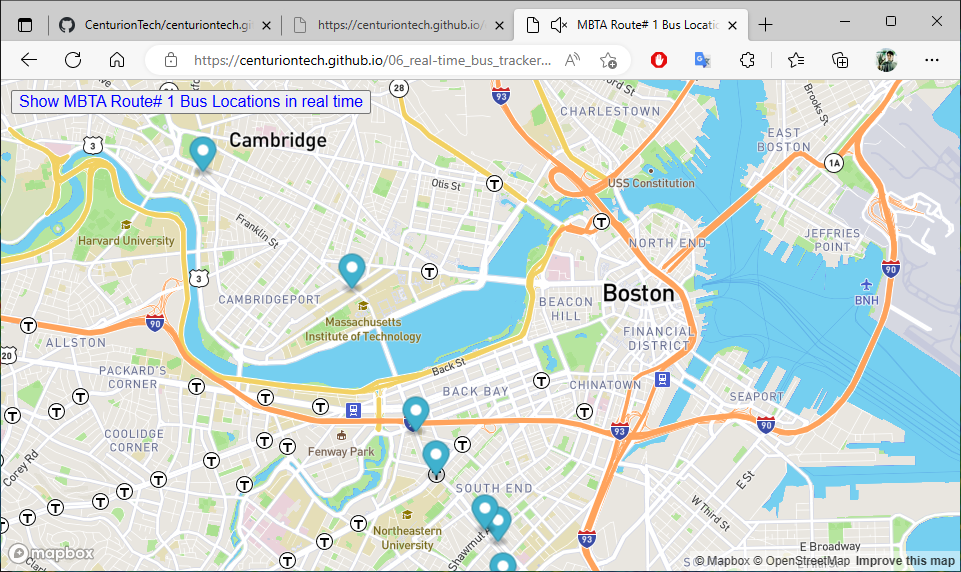

### Title of the project: MBTA Real Time Bus Tracker
Description of the project: In this exerise we use mapbox's API to Show the Buses Locations in Route#1 of MBTA in real time, we use await and fetch to load real time data from MBTA. 
How to Run: Select the link in Centurion Tech's Portfolio > Projects ,click on the button "Show MBTA Route# 1 Bus Locations in real time"  
Roadmap of future improvements: By the now I added sound effects, but in the future I will show a table of current buses in Route# 1 or other route selected.

## MBTA Real Time Bus Tracker Repository
<a href="https://github.com/CenturionTech/mbta">MBTA Route#1 Tracking </a>
